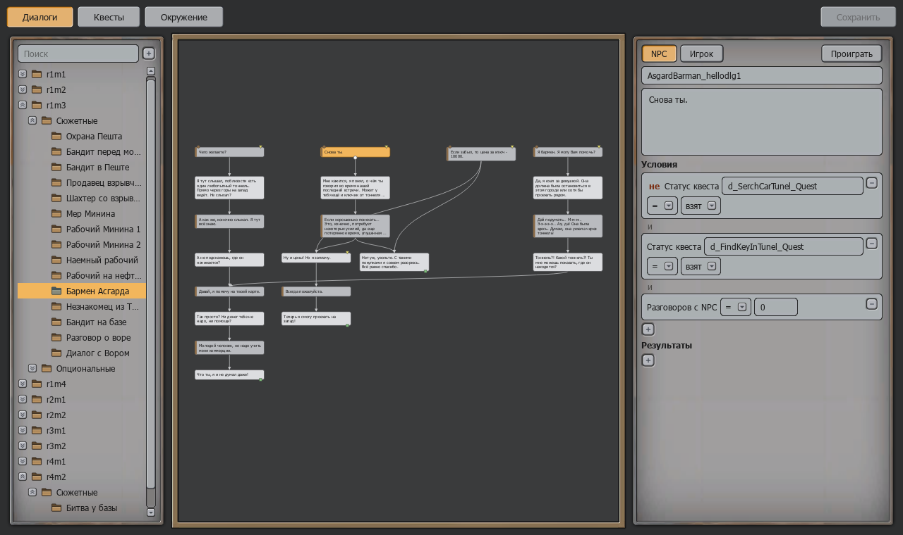
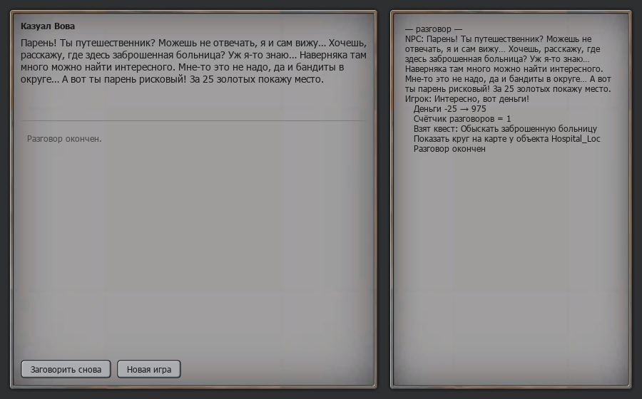
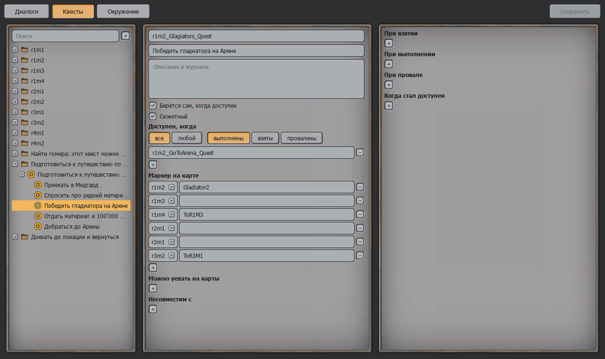
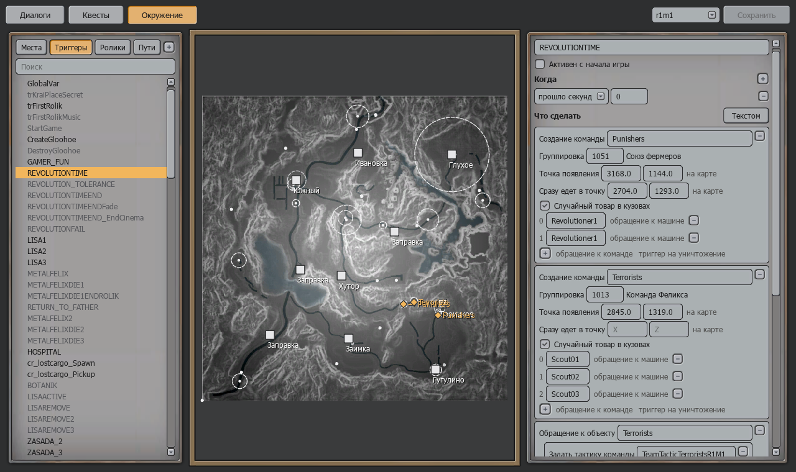
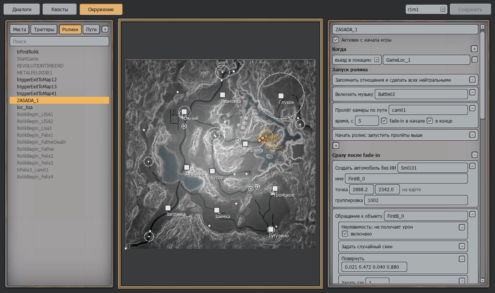
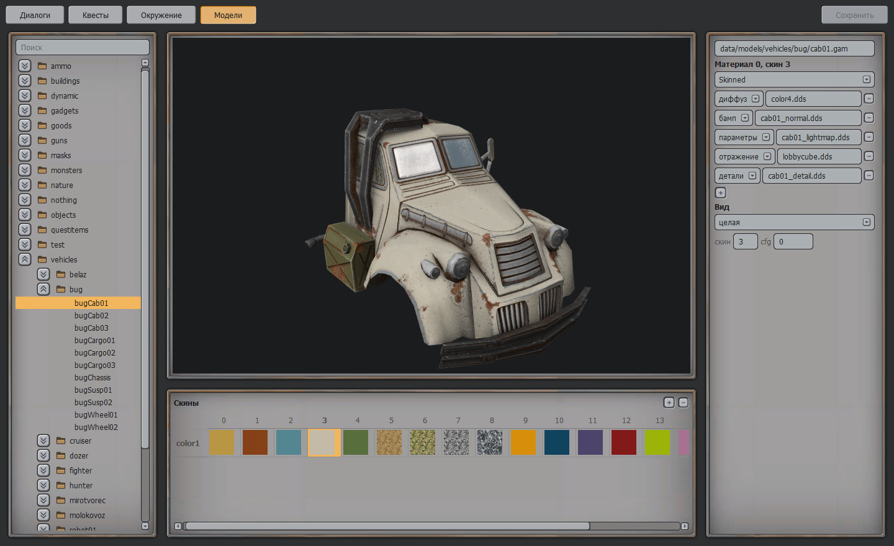
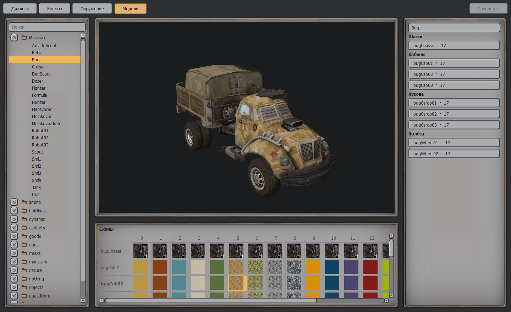
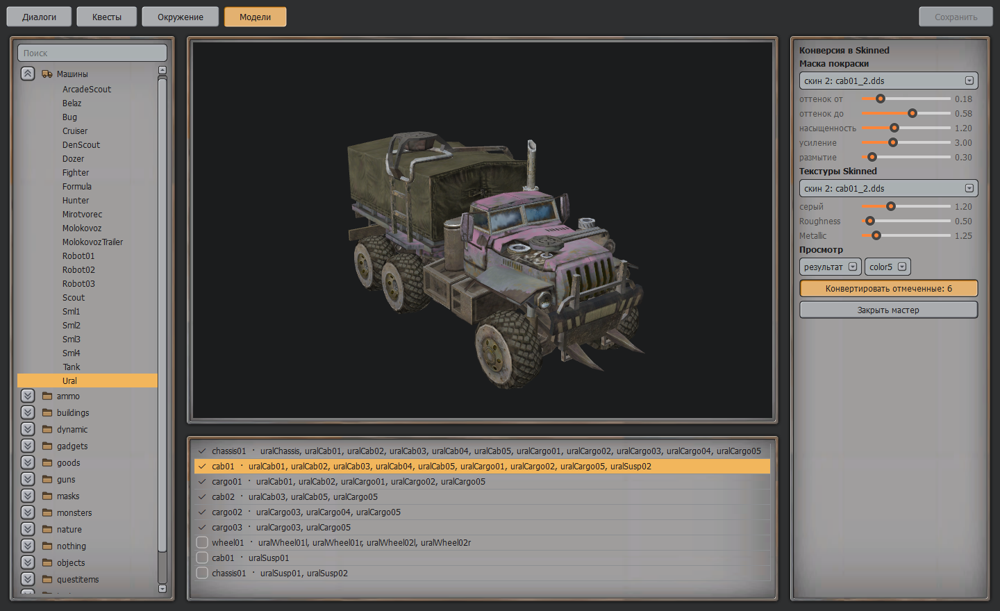
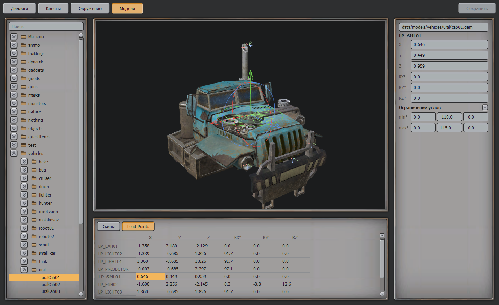

#  VersationEditor

Редактор диалогов, квестов, окружения и моделей для Ex Machina / Hard Truck Apocalypse.
Замена ConversationEditor — «Conversation Editor with no cons».

## Установка

Положите `VersationEditor.exe` в папку игры рядом с `hta.exe` и запустите. Файлы игры редактор
находит сам, ставить ничего не нужно.

Правки пишутся прямо в `data/`. Перед первой правкой каждого файла его нетронутая копия
сохраняется в `VersationEditor_backup/`.

## Диалоги



Реплики — узлы графа, переходы — стрелки. Потяните от кружка под репликой: на другую реплику —
появится переход, в пустое место — новый ответ. Условия и результаты собираются из блоков.
Реплика, после которой нет ответов и нет «Завершить разговор», подчёркнута красным: в игре
диалог на ней зависнет. Завершение добавляется одной кнопкой.

Кнопка «Проиграть» проходит диалог как в игре и показывает журнал всего, что произошло:



## Квесты



Дерево квестов с подквестами и одна форма на всё: описание в журнале, условия доступности,
маркеры на карте, действия при взятии, выполнении и провале. Оранжевый кружок — сюжетный квест,
пурпурный — необязательный.

## Окружение

Карта и три режима: «Места», «Триггеры», «Пути».



- **Места** — города, локации и NPC. Двигаются мышью прямо на карте.
- **Триггеры** — события и действия блоками: создание команды, обращение к объекту, квесты,
  камера. В меню «+» есть готовые шаблоны. Блоки копируются, вырезаются и вставляются правой
  кнопкой. Кнопка «Скрипт текстом» показывает весь Lua триггера.
- **Ролики** живут среди триггеров и помечены значком: запускающий триггер открывается лентой
  от запуска до концовки, его части свёрнуты под ним.
- **Пути** — пути камеры и езды, точки ставятся на карте.



## Модели



Просмотр `.gam` с текстурами игры и таблица скинов: строки — материалы, столбцы — скины.
Скины добавляются и удаляются, у каждого материала меняются шейдер и текстуры; в файле
переписывается только секция материалов. Правая кнопка по таблице — заполнить строку по шаблону
`cab01_{n}.dds` или скопировать материал во все скины.

У масок NPC справа выбираются шапка, очки, респиратор — и получаются числа `skin` и `cfg`.
Кнопка «Подобрать вид» у NPC и «вид» у реплики ролика открывает маску здесь и записывает
выбранное обратно.

Папка «Машины» открывает прототип целиком (`Bug`, `Molokovoz`…): шасси, все кабины и кузова
с его типом ресурса, колёса и подвеска, каждая модель один раз. В таблице строки — детали, столбцы —
скины; клик по кабине или кузову ставит их на шасси. Если скинов у деталей разное число, кнопка
«Выровнять» добавляет недостающие перед разбитым скином и продолжает нумерацию текстур.



Если у деталей машины остались материалы на старом шейдере `bumpdiffuse_envalphagloss_spec`,
справа появляется кнопка «Мастер конверсии в Skinned». В нём отмечаются наборы текстур, для
каждого ползунками настраивается маска покраски (из зелёного скина или из готового файла, например
маски камуфляжа M113) и коэффициенты Roughness / Metallic, а результат сразу виден на машине.
В синий канал lightmap запекается AO по геометрии модели, его сила задаётся ползунком.
«Конвертировать» пишет `*_detail.dds` и `*_lightmap.dds` рядом с моделью, переводит материалы
на Skinned с красками `color*` / `camo*` и доводит машину до 17 скинов. Настройки набора
сохраняются в `*_skinned.json` рядом с текстурами, поэтому уже переведённый набор можно открыть
в мастере и подкрутить заново.



Переключатель «Скины / Load Points» под просмотром показывает точки крепления `LP_*`: у выбранной
точки появляется гизмо: стрелки двигают её вдоль оси, кольца поворачивают вокруг оси. Координаты
и углы можно вписать в таблицу. Справа задаётся ограничение углов точки (как у слотов оружия
`LP_SML`, `LP_BIG`); в просмотре оно показано веерами от минимума до максимума. На собранной машине кабина, кузов
и колёса сразу встают на новое место.



Вращение — левая кнопка, сдвиг — правая, масштаб — колесо.

## Полезно знать

- Наведите курсор на блок — подсказка покажет Lua, который он запишет в файл.
- Всё, что не раскладывается на блоки, остаётся блоком «Lua» и сохраняется как было.
- `Ctrl+S` — сохранить, `Ctrl+Z` / `Ctrl+Y` — отмена и повтор, `Ctrl+1..4` — вкладки.
- Правая кнопка по папке, реплике, блоку или месту на карте открывает меню действий.
- Изменения в местах и триггерах видны только в новой игре.

## Сборка из исходников

```
pip install -r requirements.txt pyinstaller
python tests/test_core.py && python tests/test_ui.py && python tests/test_scene.py && python tests/test_models.py && python tests/test_usability.py
python build_exe.py --install
```

Нужен Python 3.10+. Тесты читают файлы установленной игры (папка уровнем выше) и ничего в неё
не пишут.
